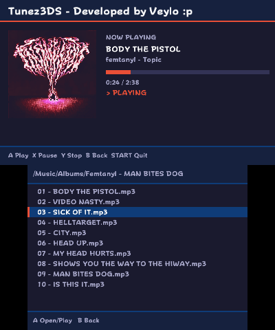

# Tunez3DS

A homebrew MP3 player for the Nintendo 3DS with a file browser, ID3 tag support, and embedded album art.

## Previews

| Nothing Playing | Now Playing |
|----------------|-------------|
|  |  |


## Features

- **File browser** on the bottom screen — navigate folders and select tracks
- **Now Playing** screen on the top screen with title, artist, and a live progress bar with timestamp
- **ID3 tag support** — reads title and artist from MP3 metadata, falls back to filename if tags are absent
- **Album art** — displays embedded JPEG or PNG cover art from ID3 tags
- **Scrolling filenames** — long filenames scroll automatically when selected
- **Smart back navigation** — pressing B to leave a folder re-selects that folder in the parent directory

## Controls

| Button | Action |
|--------|--------|
| D-Pad Up / Down | Navigate file list |
| A | Open folder / Play track |
| X | Pause / Resume |
| Y | Stop playback |
| B | Go up one folder |
| START | Quit |

## Setup

Place your MP3 files on your SD card under `sdmc:/Music`. Subfolders are supported — you can navigate into them from the file browser.

## Supported Formats

- MP3 (`.mp3`)

## Installation

1. Build or download the `.cia` file
2. Install it using a title manager such as [FBI](https://github.com/Steveice10/FBI)
3. Launch Tunez3DS from the home menu

## Building from Source

### Requirements

- [devkitPro](https://devkitpro.org/) with 3DS support (`devkitARM`)
- `libmpg123`, `libid3tag`, `libjpeg`, `libpng` (via devkitPro's pacman)
- `citro2d` / `citro3d`

### Build

```bash
make cia NO_SMDH=1
```
